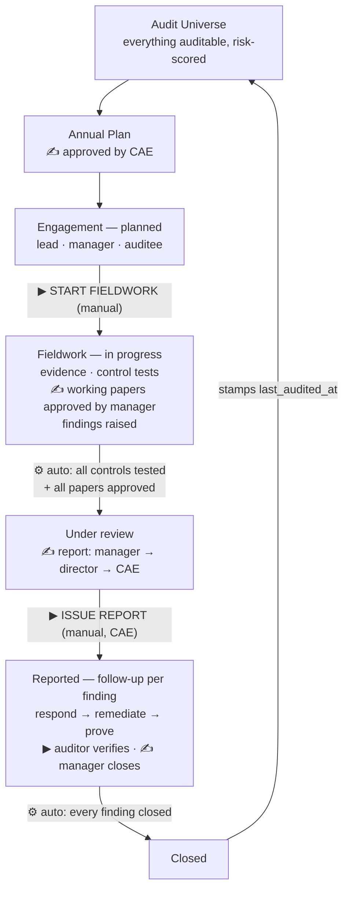

# IAMS — The Audit Flow, End to End

**Training companion to the UAT test script.** Read this first, then run `UAT_FULL_TEST_SCRIPT.md`. This explains *what happens and why*, and above all **who signs off at each gate**. The test script tells you which buttons to press; this tells you what you are looking at.

---

## The one-sentence version

GBB keeps a list of everything auditable (**the universe**), scores it for risk, and each year approves a **plan** of what will be audited. Each plan item becomes an **engagement** — one real audit. Fieldwork loads a **checklist** of controls; the team tests them, collects **evidence**, writes **working papers** the manager approves, and raises **findings**. When the work is done the engagement moves itself to review, the team writes a **report** signed off at three levels and then **issued**. Issuing opens **follow-up** on every finding until each is verified and closed — and when the last one closes, the engagement closes and the universe item is stamped "audited on this date", which is what next year's plan reads.

---

## Before anything: how authority works in IAMS

**This is the single most important thing to teach.** Everything else follows from it.

IAMS does **not** decide who can do what based on job title. It decides based on **permissions** — strings like `plan:approve`, `report:issue`, `working_paper:approve`. A **role** (`audit_manager`, `cae`, `auditee`) is nothing more than a named bundle of permissions that an administrator assembled. Change the bundle, and you change who can do what — no code change, no redeployment.

So whenever this document says *"the CAE approves the plan"*, what it **actually** means is *"whoever holds `plan:approve` approves the plan"*. At GBB that is the CAE, because that is how the roles were configured. Trainees should learn the permission, not the job title.

Two guardrails sit on top of that, and they cannot be configured away:

| Guardrail | What it means |
|---|---|
| **Segregation of duties (SoD)** | You can never approve something **you** submitted. If you are the only eligible approver, the system refuses and tells you another holder of that permission must act. You *may* reject your own submission — only the sign-off is blocked. |
| **Scoping** | Holding a permission is not the same as seeing everything. An auditor sees their own engagements; `engagement:read_all` / `finding:read_all` is what widens the view. Auditees see only their own findings, and only after the report is issued. |

The approval chains themselves live in **Settings → Approval matrix** and are editable by GBB:

```
Audit plan       → plan:approve                                              (1 level)
Working paper    → the engagement's assigned audit manager                   (1 level)
Audit report     → engagement manager → report:approve:oversight → report:approve:final   (3 levels)
Finding closure  → the engagement's assigned audit manager                   (1 level)
```

Note the difference between the two kinds of level. Some levels resolve to **a specific person** (the manager named on *this* engagement). Others resolve to **anyone holding a permission** (any active user with `report:approve:oversight`). That distinction is why an engagement must have its manager set before its working papers can be reviewed.

---

## Step 1 — The Audit Universe

*UAT Phase 1 · Module: Audit Universe + Risk*

The universe is the menu: every department, system, process, asset, and project at GBB that *could* be audited. **Nothing gets audited that isn't on this list.** Each entity carries an owner, an audit frequency (annual, biannual…), a risk score, and — once it has been audited — a `last_audited_at` date.

Alongside it sits the **risk register**: things that could go wrong, scored `likelihood × impact`. Risks are attached to universe entities, so a universe entity carrying big risks is one you want to audit sooner.

**Who approves:** nobody. The universe and register are maintained records, not approved documents. Creating and updating them needs `universe:create` / `universe:update` and `risk:create` / `risk:update` — at GBB, the audit manager. This is deliberate: the foundation must be kept current without a sign-off ceremony every time.

> **Why it matters downstream:** the risk score, the count of open findings, and the `last_audited_at` date are the exact inputs the planning module uses to rank what deserves auditing next year. A neglected universe produces a badly prioritised plan.

---

## Step 2 — The Annual Plan

*UAT Phase 2 · Module: Planning*

Once a year the audit function decides what it is committing to audit. The **audit manager** creates the plan for the year and adds **plan items** — one line each: which universe entity, what type of audit (financial, IT, compliance…), what priority, planned dates.

The system helps rank them. A **risk-based priority score** is computed per entity from five weighted signals (weights are editable in Settings):

| Signal | Default weight |
|---|---|
| Risk score | 40 |
| Open findings against it | 25 |
| Overdue for its audit frequency | 20 |
| Never audited at all | 10 |
| Time since last audit | 5 |

The manager then **submits** the plan. At that point it locks — the manager can no longer edit it.

### ✍ Approval gate 1 — the plan

**Who approves: the holder of `plan:approve`.** At GBB that is the **Chief Audit Executive (CAE)**. One level, one signature.

- The **audit manager who submitted it cannot approve it** — SoD blocks self-approval. This is tested deliberately in UAT Phase 16.4.
- A **rejection** comes back with a written reason. The manager fixes and re-submits, and the chain restarts.
- On approval, the plan becomes the department's committed programme for the year, and a notification fires back to the manager.

> **Nothing can be audited until this approval exists.** The engagement-creation check refuses to build an engagement from an unapproved plan.

---

## Step 3 — The Engagement

*UAT Phase 2.3 and 3 · Module: Engagement*

When it is time to actually run one of those planned audits, the plan item becomes an **engagement** — the central object in the whole system. It gets a reference like `AUD-2026-001` and starts at status **planned**.

Before it will let you create one, the system checks: the plan is approved, this plan item doesn't already have an engagement, the named manager can actually approve things, the lead auditor is available, the auditee is an active user. The audit type and priority are **inherited from the plan item** — you don't retype them.

You then set up the engagement:

- **Lead auditor** — does the fieldwork day to day.
- **Audit manager** — supervises, and is the person the approval matrix resolves to for working papers, finding closures, and level 1 of the report.
- **Auditee** — the department or person being audited: supplies evidence, answers findings, does the fixing.
- **Supporting auditors** — added as assignments.
- **Assets in scope** — link the systems and databases this audit covers. These carry through automatically to findings, to risks, and to the "Assets in scope" table on the issued report.

**Who approves:** nobody. Creating an engagement is an execution of the already-approved plan, not a new commitment. It needs `engagement:create`. (Urgent unplanned audits can be created ad-hoc, but require a written justification.)

Then the lead auditor or manager presses **Start fieldwork**. Two things happen: the actual start date is recorded, and **the checklist auto-populates** with the control set for that audit type. Status → **in progress**.

> **This is one of only two buttons in the entire lifecycle that a human presses to move an audit forward.** The other is *Issue report*. Everything else advances on its own once its conditions are met.

---

## Step 4 — Fieldwork

*UAT Phase 4 and 5 · Modules: Checklists, Sampling, Evidence, Working Papers, Findings*

This is the bulk of the work, and the four strands happen in whatever order suits the audit.

### Testing the controls
The checklist arrived pre-loaded from the **compliance control library** — ISO 27001, PCI DSS, NDPR, plus any custom controls GBB added. The auditor works through it marking each control **passed**, **failed**, or **not applicable**, attaching the evidence that proves the conclusion. A failed control is where findings come from.

### Collecting evidence
Rather than emailing the auditee, the auditor raises a formal **evidence request** (PBC): *"Provide Q1 bank reconciliations"*, assigned, with a due date. The auditee uploads against it; the auditor **accepts** it or **returns** it with a reason for more. Every file is sealed with a **SHA-256 hash** on upload and integrity-verified on download — that is the chain of custody.

Where a population has to be tested, the **sampling** tool computes a statistically defensible sample size and draws the sample from an uploaded population, attaching both the population and the sample back to the engagement as evidence, along with a written methodology. Re-running with the same seed reproduces the identical selection.

### Writing working papers
The working paper is the professional record: what was tested, how, what evidence was reviewed, what was observed, what was concluded. *If someone asks "how do you know that?", the working paper is the answer.* Every edit increments a version and keeps a snapshot.

### ✍ Approval gate 2 — every working paper

**Who approves: the audit manager assigned to that engagement.** Not "any manager" — the specific person named on this engagement.

- The preparer submits; a workflow approval routes to the manager.
- The manager can **comment** (back to the preparer to address), **reject** with a reason (rework and resubmit), or **approve** — including *approve-with-edit*, fixing a small problem in the same step instead of bouncing the whole paper back.
- **The preparer cannot approve their own paper**, even if they hold `working_paper:approve`. UAT Phase 16.3 tests this.
- The approved paper's PDF/DOCX export carries a **sign-off block** with the approver's name, role, date, and signature image.

### Raising findings
Wherever a control fails, the auditor raises a **finding** covering the five C's: the condition (what's wrong), the criteria (the control it breaches), the cause (root cause), the consequence (risk implication), and the corrective action (recommendation) — plus severity, owner, and a due date. Raising it straight from a failed checklist item carries the control's details across.

Findings are linked to the working paper, to the risk register, and to the assets in scope.

**Who approves a finding:** nobody, at this stage. Raising it needs `finding:create`. A finding is an auditor's professional judgement, and it goes through sign-off as part of the report — not individually. (Its *closure*, much later, does need approval.)

> **Auditee visibility rule — teach this explicitly.** While the engagement is in progress, **the auditee cannot see the findings**. They become visible only when the report is issued. This prevents piecemeal argument over draft conclusions. UAT tests both sides of the flip: Phase 5 (not visible) and Phase 7 (visible).

---

## Step 5 — The engagement moves itself to review

*UAT Phase 8 · Module: Engagement lifecycle gates*

**There is no "send to review" button.** The moment two conditions are both true, the system advances the engagement to **under review** on its own:

1. Every checklist item has been tested (none left as `not_tested`), and
2. Every working paper is approved (and at least one exists).

Until then, the engagement screen shows exactly what is outstanding — *"4 of 12 checklist procedures not yet tested"*. Both conditions are switches an administrator can turn off if GBB wants a looser process.

**Who approves:** nobody — this is a gate, not an approval. The approvals already happened, on each working paper. The gate just checks they are all in.

---

## Step 6 — The Report

*UAT Phase 7 · Module: Report*

The team writes the report: executive summary, scope, methodology. **One report per engagement.** The findings are **assembled automatically** — a severity-sorted summary table plus the detail — as is the "Assets in scope" table. Nobody retypes findings into the report, which is what keeps the report and the finding register from drifting apart.

Then it is submitted, and a **three-level approval chain** is created.

### ✍ Approval gate 3 — the report, in three levels

| Level | Who | Resolved by | At GBB |
|---|---|---|---|
| **1 — Engagement manager** | The manager named on this engagement | a specific person | Audit Manager |
| **2 — Oversight** | Any active holder of `report:approve:oversight` | permission | Director |
| **3 — Final** | Any active holder of `report:approve:final` | permission | CAE |

The levels are **sequential** — level 2 cannot act until level 1 has signed. Each approver signs with their stored signature.

- Any level can **reject** with a reason. That sends the report back, and re-submission **restarts the chain from level 1**.
- Any level can **approve-with-edit** — fix a small problem and sign in one step.
- **Whoever submitted the report cannot sign any level of it.** SoD applies at every level, not just the first.

### ▶ Issuing — the second and last manual button

Once all three levels are approved, the report is **issued** by the holder of **`report:issue`** — at GBB, the **CAE**. Note this is a *separate permission from approval*: a Director who approved level 2 still cannot issue, and a lead auditor certainly cannot (UAT Phase 16.6 tests this denial).

Issuing is the moment the audit becomes official. At that instant:

- the report is **locked** and a signed, unchangeable copy is stored,
- the engagement moves to **reported**,
- a **follow-up is opened on every single finding**,
- the **auditee is notified — and can now see the findings** for the first time.

---

## Step 7 — Follow-up on every finding

*UAT Phase 6 · Module: Follow-up*

The audit is not finished when the report is issued. It is finished when the problems are fixed. For each finding, the same loop runs:

1. **Management response** — the auditee writes back: how they will fix it and by when. Status → *management response received*.
2. **Remediation** — they do the work. Status → *in remediation*.
3. **Proof** — they upload evidence that it is actually fixed.
4. **Verification** — the **auditor** checks the proof. Good enough → the finding is **verified**. Not good enough → it goes back to the auditee to redo.
5. **Closure** — the auditor requests closure, and it is approved.

### ✍ Approval gate 4 — verification and closure

Two distinct controls here, and trainees confuse them:

- **Verification** needs `followup:verify` — held by the **audit team** (lead auditor, manager). **The auditee cannot verify their own remediation.** They can respond, remediate, and upload proof; they can never mark their own fix as good. UAT Phase 16.5 tests the denial.
- **Closure** is a workflow approval routed to the **engagement's audit manager**. The auditor who verified it requests closure; the manager signs it off. Only then is the finding **closed**.

Findings cannot skip steps, and nobody closes their own finding unilaterally.

> **The risk feedback loop:** when a finding is verified, the owner of any linked risk — and the owners of risks on the same universe entity — get a *"reassess this risk"* notification. The control environment changed, so the risk score should be revisited. That reassessment feeds back into next year's plan ranking.

---

## Step 8 — The engagement closes itself

*UAT Phase 8*

When the **last finding on the engagement is closed**, the system closes the engagement automatically. It stamps the actual end date, and it writes **`last_audited_at`** onto the universe entity.

And that date is precisely what next year's planning reads when it decides what is overdue.

**The loop closes.**

---

## Who approves what — the one-page summary

| # | What | Who signs | Resolved by | Levels | Self-approval? |
|---|---|---|---|---|---|
| 1 | **Audit plan** | CAE | `plan:approve` | 1 | ❌ blocked |
| 2 | **Working paper** | The engagement's audit manager | specific person | 1 | ❌ blocked |
| 3 | **Audit report** | Manager → Director → CAE | person, then `report:approve:oversight`, then `report:approve:final` | 3, sequential | ❌ blocked at every level |
| 4 | **Issue the report** | CAE | `report:issue` | — (an action, not an approval) | n/a |
| 5 | **Remediation verification** | Audit team | `followup:verify` | — | ❌ auditee can never verify their own |
| 6 | **Finding closure** | The engagement's audit manager | specific person | 1 | ❌ blocked |

**Not approved by anyone** (deliberately): universe entries, risk register entries, engagement creation, checklist results, evidence uploads, and raising a finding. These are either maintained records or professional judgement that gets its sign-off later, as part of the working paper or the report.

---

## What moves the audit forward

Only **two** transitions in the entire lifecycle are a human pressing a button:

| | Transition | Who |
|---|---|---|
| ▶ | **Start fieldwork** — `planned` → `in progress` | Lead auditor / manager |
| ▶ | **Issue report** — makes the audit official | CAE (`report:issue`) |

Everything else the system advances on its own once the gates are satisfied:

| | Transition | Gate |
|---|---|---|
| ⚙ | → **under review** | all checklist items tested **and** all working papers approved |
| ⚙ | → **reported** | a report has been issued |
| ⚙ | → **closed** | every finding is closed |

If an engagement seems "stuck", it is never a bug in the button — **read the gate status on the engagement screen**, which names exactly what is outstanding. An hourly background job re-checks every engagement, so a gate satisfied out of band still advances within the hour.

---

## The diagram

```
        ┌──────────────────────────────────────────────────────────────┐
        │                                                              │
        ▼                                                              │
   AUDIT UNIVERSE                                                      │
   everything auditable, risk-scored          (no approval)            │
        │                                                              │
        ▼                                                              │
   ANNUAL PLAN  ──── submitted ───▶ approved ✍  CAE · plan:approve     │
   what we'll audit this year                                          │
        │                                                              │
        ▼                                                              │
   ENGAGEMENT  ·············································· planned   │
   lead · manager · auditee · assets            (no approval)          │
        │                                                              │
        │  ▶ START FIELDWORK  (manual)                                 │
        │    checklist auto-loads                                      │
        ▼                                                              │
   FIELDWORK  ··············································in progress │
   ┌──────────────┬───────────────┬────────────────┬────────────────┐  │
   │ request &    │ test the      │ write working  │ raise          │  │
   │ collect      │ controls      │ papers         │ findings       │  │
   │ EVIDENCE     │ (checklist)   │ ✍ MANAGER      │ (not yet       │  │
   │ SHA-256      │               │   approves     │  visible to    │  │
   │              │               │   each one     │  the auditee)  │  │
   └──────────────┴───────────────┴────────────────┴────────────────┘  │
        │                                                              │
        │  ⚙ auto — all controls tested + all papers approved          │
        ▼                                                              │
   REPORT  ················································under review │
   findings auto-assembled                                             │
   submit ▶ ✍ MANAGER ▶ ✍ DIRECTOR (oversight) ▶ ✍ CAE (final)         │
        │                                                              │
        │  ▶ ISSUE REPORT  (manual, CAE · report:issue)                │
        │    report locked · follow-up opened per finding              │
        │    ✱ auditee can now see the findings                        │
        ▼                                                              │
   FOLLOW-UP  ·················································reported │
   auditee responds ▶ remediates ▶ uploads proof                       │
   ▶ AUDITOR verifies (auditee may NOT verify their own)               │
   ▶ ✍ MANAGER approves closure                                        │
        │                                                              │
        │  ⚙ auto — every finding closed                               │
        ▼                                                              │
   CLOSED  ─── stamps "last audited" on the universe item ─────────────┘
                                              feeds next year's plan

   ▶ = a person presses a button      ⚙ = the system advances it itself
   ✍ = signed approval                ✱ = a visibility rule changes
```



---

## Five things trainees always get wrong

1. **"I have the permission, so why can't I approve it?"** — because you submitted it. SoD blocks self-approval at every level, on every entity type. Someone else has to sign.
2. **"Approving the report issues it."** — no. Level 3 approval and `report:issue` are separate. Approving says *the content is right*; issuing says *this is now official*, and only `report:issue` does that.
3. **"The auditee can't see the finding — that's a bug."** — that is the rule. Findings become visible to the auditee at report issue, not before.
4. **"The engagement is stuck, there's no button."** — there is no button by design. Read the gate status; it names the outstanding checklist items or unapproved papers.
5. **"Role X can do Y."** — roles are configurable bundles. The permission is what's real. Always answer with the permission, then say which role happens to hold it at GBB today.

---

## Running the UAT session

| Step here | UAT phase | Log in as |
|---|---|---|
| Roles, users, settings | Task 0 | SA |
| Universe & risk | Phase 1 | MGR |
| Plan → submit → approve | Phase 2 | MGR, then **CAE** |
| Engagement setup, assets, start | Phase 3 | MGR (+ SA for assets) |
| Fieldwork, evidence, papers, findings | Phase 4–5 | LEAD, STAFF, AUDITEE, **MGR approves** |
| Follow-up, verify, close | Phase 6 | AUDITEE, LEAD, **MGR approves** |
| Report → 3 approvals → issue | Phase 7 | MGR → **DIR** → **CAE** |
| Engagement auto-closes | Phase 8 | MGR |
| Guardrails / denials | Phase 16 | everyone |

Phase 16 is the one not to skip in training. Watching an approval get **refused** teaches the model of authority faster than watching ten of them succeed.

---

*See also: [`GLOSSARY_AND_AUDIT_FLOW.md`](./GLOSSARY_AND_AUDIT_FLOW.md) for term-by-term definitions, and [`UAT_FULL_TEST_SCRIPT.md`](./UAT_FULL_TEST_SCRIPT.md) for the step-by-step click-through.*
