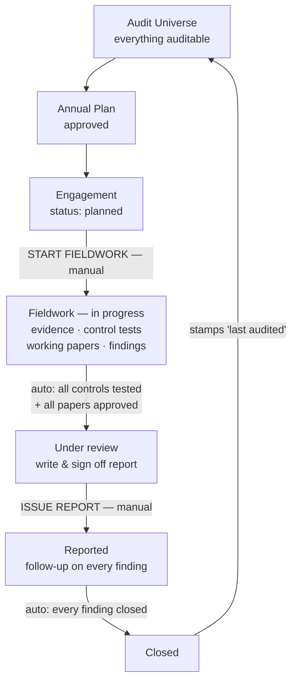

# IAMS in Plain English

What the words mean, and how an audit actually runs from start to finish.

---

## Part 1 — The words

### Audit Universe
The list of everything at GBB that *could* be audited — every department, system, process, asset, and project. Think of it as the menu. Nothing gets audited that isn't on this list. Each item has an owner, how often it's supposed to be audited, and a risk score.

### Risk
Something that could go wrong for GBB. Risks are scored (how likely × how bad), and they attach to universe items. A universe item carrying big risks is one you want to audit sooner.

### Audit Plan
The year's programme of work. Once a year the audit department looks at the universe and decides: *these* are the audits we're committing to do this year. That commitment is the plan, and it gets formally approved before any of it happens.

### Plan Item
One line on that plan. "Audit the payroll system, IT audit, March to April, high priority." A plan item is a promise, not work — nothing is being audited yet.

### Engagement
**The actual audit.** This is the central thing in the whole system. An engagement is one real audit being carried out: it has a reference number (AUD-2026-004), a lead auditor doing the work, an audit manager supervising, and an auditee — the person or department being audited. Everything else in the system hangs off an engagement.

Each approved plan item turns into one engagement when it's time to start it. Urgent audits that weren't planned can also be created directly — those are "ad-hoc" and need a written reason.

### Checklist / Control Test
The list of controls the auditor has to test on this engagement. A control is a rule that's supposed to be in place ("access rights are reviewed quarterly"), and the checklist item says what the control is and how to test it. The auditor works through the list marking each one passed, failed, or not applicable.

### Evidence
The files that prove the auditor actually looked at something — screenshots, logs, exports, policies, signed forms. Evidence is attached to whatever it supports: a control test, a working paper, or a finding.

### Evidence Request
Instead of emailing the auditee "please send me X", the auditor raises a formal request in the system. The auditee uploads the files against it, and the auditor either accepts them or sends it back asking for more. This is the paper trail of what was asked for and when.

### Working Paper
The auditor's written record of the work done: what was being tested, how it was tested, what evidence was reviewed, what was observed, and what was concluded. It's the professional documentation — if someone asks "how do you know that", the working paper is the answer. Every working paper is reviewed and approved by the audit manager before it counts.

### Finding
Something wrong that the audit uncovered. A finding says: here's the weakness, here's why it exists (root cause), here's what could go wrong because of it, here's what should be done about it, here's who owns fixing it, and here's the deadline. Findings have a severity — critical down to informational.

### Audit Report
The formal deliverable at the end of the audit: executive summary, what was covered, how it was done, and all the findings. It goes through sign-off, gets signed, and then gets *issued* — formally handed to the auditee. Issuing is the moment the audit becomes official.

### Follow-Up
What happens after the report. For each finding: the auditee writes back saying how they'll fix it, they go and fix it, they upload proof, and the auditor checks the proof is real. Only then can the finding be closed.

### Approval
A sign-off chain. Plans, working papers, reports, and finding closures all need approving before they're final. Each approval has levels — for a report it's the audit manager, then oversight, then final executive sign-off. Approvers sign with a stored signature, and the signed document is frozen so it can't be changed afterwards.

### Escalation
If something sits too long — an engagement past its deadline, an approval nobody has acted on — the system chases it. First the lead auditor, then the audit manager, then the director, then the CAE. Nobody has to remember to follow up.

### The people

- **Lead auditor** — does the fieldwork day to day.
- **Audit manager** — supervises the engagement and is usually the first approver.
- **Auditee** — the person being audited: supplies evidence, answers findings, does the fixing.
- **Director / CAE** — senior sign-off on reports, and where things escalate to.

---

## Part 2 — The full flow

### 1. You set up the universe (once, then maintained)

Someone lists every auditable thing at GBB — departments, systems, processes. Risks get attached to them and scored. This is the foundation; you only do the big version once, then keep it current.

### 2. You build the annual plan

The audit manager creates a plan for the year and adds items to it. The system helps here — it ranks the universe by which items most deserve auditing, based on their risk score, how many findings are still open against them, whether they're overdue for their audit frequency, and whether they've ever been audited at all.

The plan is submitted, someone approves it, and now it's the department's committed programme for the year. If it's rejected it comes back with a reason and can be fixed and re-submitted.

### 3. You create the engagement

When it's time to actually do one of those planned audits, the plan item becomes an engagement. You name the lead auditor, the audit manager, and the auditee, set the dates and the deadline, and optionally budget hours.

The system checks the obvious things before letting you: the plan must actually be approved, this plan item mustn't already have an engagement, the manager must actually be able to approve things, the lead auditor must be available, the auditee must be an active user. What kind of audit it is and how urgent — those come from the plan item, you don't retype them.

The engagement is created with a reference number and sits at **planned**. Nothing else exists yet.

### 4. You start fieldwork

The lead auditor hits "start fieldwork". Two things happen: the start date is recorded, and **the checklist is automatically filled in** with the right set of controls for that type of audit. The engagement is now **in progress**.

This is one of only two buttons in the whole lifecycle that a human presses to move an audit forward.

### 5. The team does the audit

This is the bulk of the work, and it happens in whatever order suits:

- **Ask for documents.** The auditor raises evidence requests; the auditee uploads against them; the auditor accepts or returns them.
- **Test the controls.** Work through the checklist, mark each control passed or failed, attach the evidence that proves it.
- **Write working papers.** Document the testing properly. Submit each one to the audit manager, who reviews it — they can leave comments for the preparer to address, edit it themselves and approve, or reject it back for rework.
- **Raise findings.** Wherever a control fails or something's wrong, raise a finding. Raising it from a failed control test carries the control's details across automatically, and the auditee is told about it immediately.

### 6. The engagement moves itself to review

There is no "next stage" button. The moment **every control has been tested** and **every working paper is approved**, the system moves the engagement to **under review** on its own. Until then, the engagement screen tells you exactly what's still outstanding — "4 of 12 checklist items not yet tested".

(Both of those conditions are switches an administrator can turn off if GBB wants a looser process.)

### 7. The report

The lead auditor generates the report — executive summary, scope, methodology, and the findings. One report per engagement.

It's submitted and goes through three levels of sign-off: audit manager, then oversight, then final executive approval. Each approver signs it. An approver who spots a small problem can fix it and approve in the same step rather than bouncing the whole thing back. A rejection sends it back with a reason and restarts the chain when it's re-submitted.

Once fully approved, the report is **issued** — the second and last manual button. At that moment:
- the report is locked and a signed, unchangeable copy is stored,
- the engagement moves to **reported**,
- a follow-up is opened for every single finding,
- the auditee is notified.

### 8. Follow-up on every finding

For each finding, the same loop:

1. The auditee writes their **management response** — how and when they'll fix it.
2. They do the work — the finding is **in remediation**.
3. They upload **proof** that it's fixed.
4. The auditor **verifies** the proof. Good enough → the finding is **verified**. Not good enough → back to the auditee.
5. The auditor **requests closure**, and the audit manager approves it. Only then is the finding **closed**.

Findings can't skip steps, and nobody can close their own finding unilaterally.

### 9. The engagement closes itself

When the last finding on the engagement is closed, the system closes the engagement automatically and stamps the universe item as "audited on this date".

And that date is exactly what next year's planning looks at when deciding what's overdue. The loop closes.

---

## In one paragraph

GBB keeps a list of everything auditable (**the universe**), scores it for risk, and each year approves a **plan** of what will be audited. Each planned item becomes an **engagement** — a real audit with a lead auditor, a manager, and an auditee. Starting fieldwork loads a **checklist** of controls; the team tests them, gathers **evidence**, documents the work in **working papers** the manager approves, and raises **findings** where things are wrong. Once all controls are tested and all papers approved, the engagement moves itself to review, where the team writes a **report** that is signed off at three levels and then **issued**. Issuing opens a **follow-up** on every finding: the auditee responds, fixes, and proves it; the auditor verifies and closes it with approval. When the last finding closes, the engagement closes and the universe item is marked freshly audited — which is what next year's plan reads.

---

## The flow as a diagram

```
        ┌──────────────────────────────────────────────────────────────┐
        │                                                              │
        ▼                                                              │
   AUDIT UNIVERSE                                                      │
   everything auditable, risk-scored                                   │
        │                                                              │
        ▼                                                              │
   ANNUAL PLAN  ──── submitted ───▶ approved ✍                        │
   what we'll audit this year                                          │
        │                                                              │
        ▼                                                              │
   ENGAGEMENT  ·············································· planned   │
   one real audit                                                      │
        │                                                              │
        │  ▶ START FIELDWORK  (manual)                                 │
        │    checklist auto-loads                                      │
        ▼                                                              │
   FIELDWORK  ··············································in progress │
   ┌──────────────┬───────────────┬────────────────┬────────────────┐  │
   │ request &    │ test the      │ write working  │ raise          │  │
   │ collect      │ controls      │ papers         │ findings       │  │
   │ EVIDENCE     │ (checklist)   │ (approved ✍)   │                │  │
   └──────────────┴───────────────┴────────────────┴────────────────┘  │
        │                                                              │
        │  ⚙ auto — when all controls tested + all papers approved     │
        ▼                                                              │
   REPORT  ················································under review │
   write ▶ submit ▶ approve ✍ ×3  (manager → oversight → final)        │
        │                                                              │
        │  ▶ ISSUE REPORT  (manual)  → follow-up opened per finding    │
        ▼                                                              │
   FOLLOW-UP  ·················································reported │
   response ▶ remediate ▶ proof ▶ verified ▶ closure approved ✍        │
        │                                                              │
        │  ⚙ auto — when every finding is closed                       │
        ▼                                                              │
   CLOSED  ─── stamps "last audited" on the universe item ─────────────┘
                                              feeds next year's plan

   ▶ = a person presses a button      ⚙ = the system advances it itself
   ✍ = signed approval
```


